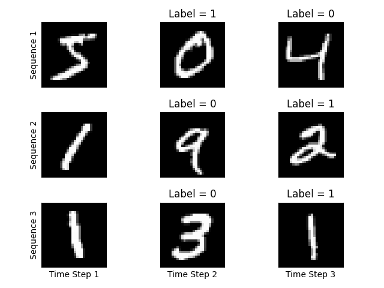
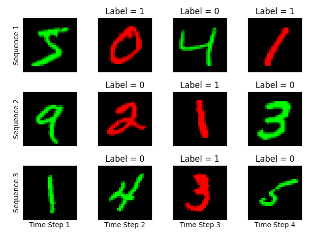
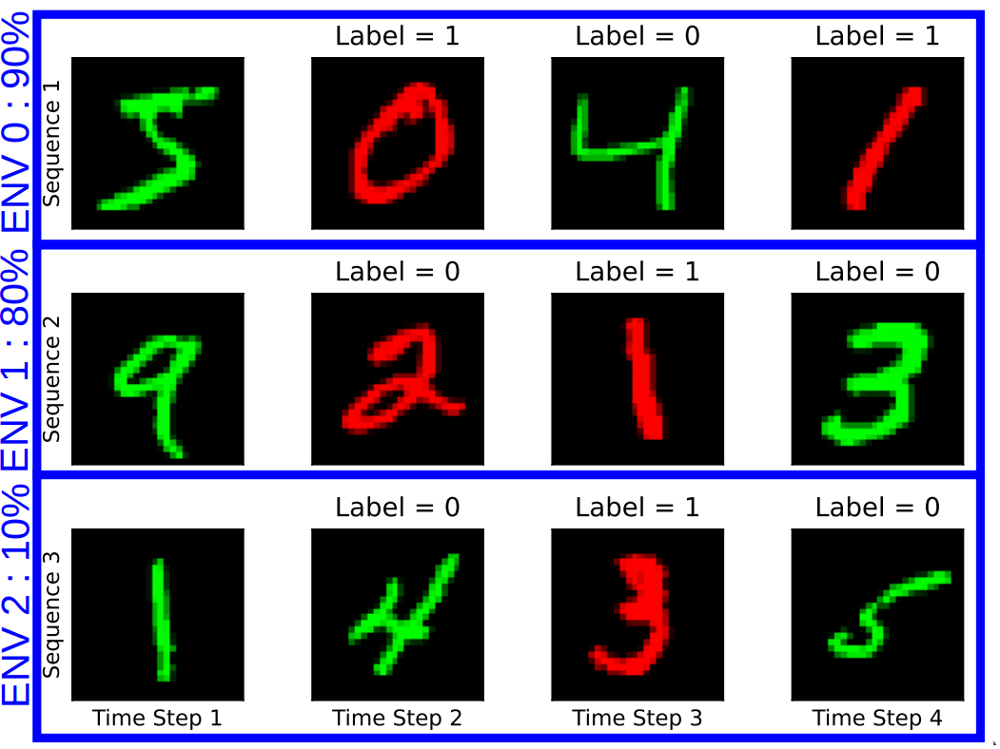
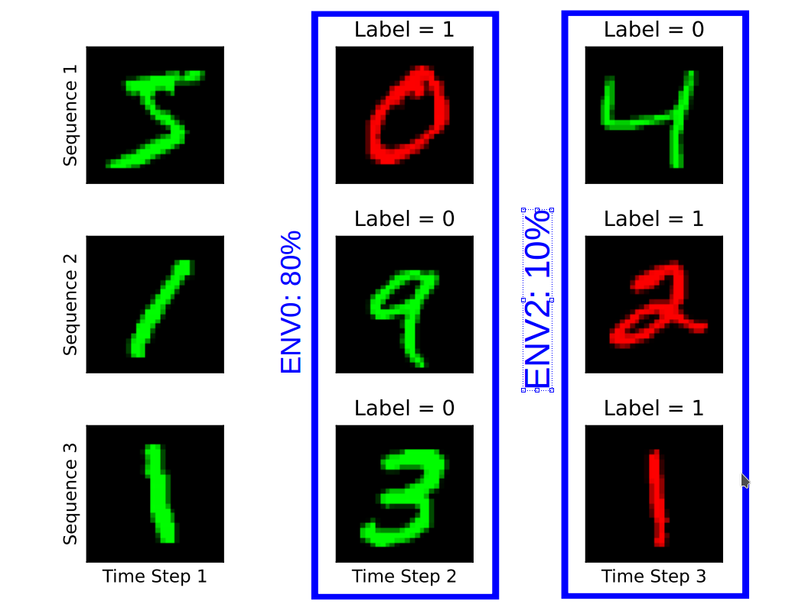

# Temporal_OOD
Repository aiming to benchmark OOD performance of temporal data.

## Current benchmark

### Greyscale
We create a sequence of 3 digits (one digit per frame) and the task is to predict if the last digit seen is bigger than the current digit.

### OOD setup
We add 25% label noise to the dataset and add colors to the images that is correlated with different degrees to the labels. This degree of correlation is dictated by the environment from which the sample is taken from.

## Definition of environments
Two definition of environments are of interest in this dataset.

### Sequences as environments
First definition of interest is the setup where a single sequence is taken from an enviroment and the level of correlation between the color and the label is constant across time-steps.

### Time steps as environments
The second definition of interest is the setup where every time step is an environment, so sequences of data have different level of correlation of color within the sequence

